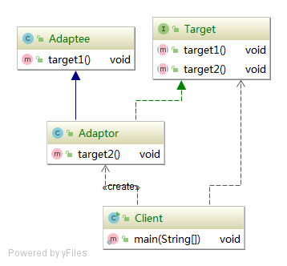
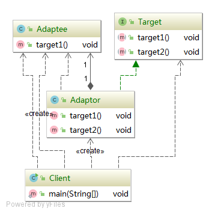
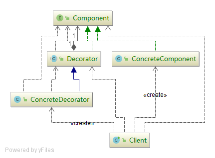

# java design learn code

所有资源来源于网络：慕课网、[潘建南博客](https://me.csdn.net/pange1991)

## factory design pattern

## builder design pattern

## proxy design pattern
### static proxy design
### JDK dynamic proxy pattern
### cglib dynamic proxy pattern

## template design pattern 

## Adapter pattern

- 目标抽象类（Target）：客户端所期待的目标
- 适配器类（Adapter）：适配器把源接口转换成目标接口。显然，这一角色不可以是接口，而必须是具体类。
- 适配者类（Adaptee）：现在需要适配的源接口
- 客户端（Client）： 调用目标类的目标方法，其实最后就是去调用 Target 抽象类的抽象方法。

### 类适配器模式

通过继承 Adaptee, 实现 Target, 对适配器进行一个补充。

1. 先定义一个目标类 Target, 该类中定义所有理想的目标方法。
   
   比如： 
   `TargetClass` 类，有两个方法： 
   - target1()  # Adaptee中已有的方法
   - target2() 
   
   这两个目标方法是Client所期望调用的方法。
   target1()方法是 Adaptee 已存在的方法。target2() 在Adaptee中不存在。
   
2. `Adaptee` 中只有一个 `target1()` 方法，无法提供第二个方法
3. `Adapter` 继承 `Adaptee` ，并且实现 `Target` 中的方法。
4. `Client` 使用 `Target` 中的方法。
    

### 对象适配器模式

与类的适配器模式一样，对象的适配器模式把被适配的类的API转换成为目标类的API。
与类的适配器模式不同的是，对象的适配器模式不是使用继承关系连接到Adaptee类，
而是使用委派关系连接到Adaptee类。

1. 定义一个 `Target` 接口，该类中定义所有理想的目标方法。同**类适配器模式**
2. `Adaptee` 中只有一个 `target1()` 方法，无法提供第二个方法
3. `Adapter` 实现 `Target` 中的方法。
   
   其中，实现 `Target` 的方法 `target1()`时，是通过委派的方式。
   在实例化 `Adapter` 时，通过构造方法传入委派类实例 `Adaptee`。
   然后，实现 `target2()` 方法。
   
4. `Client` 实例化 `Adaptee`，然后通过构造 `Adapter` 实例化 `Target`

## Decorator Pattern

装饰模式的用意是在不改变接口的前提下，增强所考虑的类的性能

- Component（抽象构件）：给出一个抽象接口，以规范准备接收附加责任的对象。
- ConcreteComponent（具体构件）：定义一个将要接收附加责任的类。
- Decorator（装饰）：持有一个构件(Component)对象的实例，并定义一个与抽象构件接口一致的接口。
- ConcreteDecorator（具体装饰）：负责给构件对象“贴上”附加的责任

